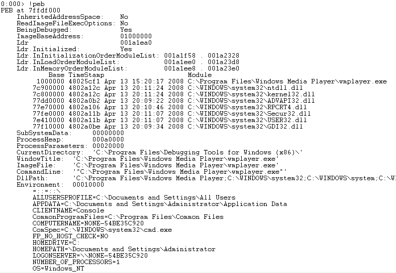
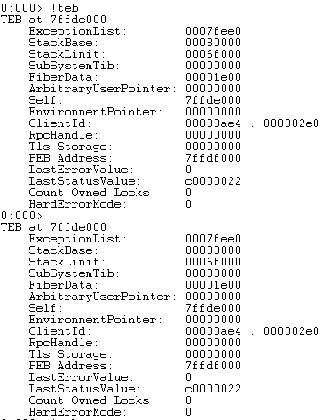

Windows Memory Layout and Program Instructions
==============================

x86 Intel Syntax
------------------

`MOV [dest] [src]`

[dst] = a pointer = the object/space at the given address

Likewise with registers:

`MOV [EAX] [ECX]`

This says to take the data at [the address stored in register ECX] and write it over the data at [the address stored in register EAX]. Both [EAX] and [ECX] are pointers to memory locations. If we assume that something relevant is at each memory location--a string longer than one DWORD is stored at [the address stored in register ECX] (aka at [ECX]). This MOV operation then writes the same string at [the address stored in register EAX] (aka at [EAX]).

An easy way to remember this without getting wrapped around the "is it the value stored in the register or the value *stored at the address* stored in the register?" axle, is to memorize the instruction and its plain-English description below.

`MOV EAX [ECX]` means "Write the data stored in memory at the address held by ECX over the data held by EAX."

Memory Layout
-----------------

Simplified diagram of the memory layout of a typical program running in Windows:

Function Calls
---------------

When we encounter a function call, a new stack frame forms. Before and after that frame forms, data is pushed to the stack. This table aims to help one visualize the process by showing instructions and the stack step by step.

Definitions
------------

**PEB** - Process Environment Block  

**TEB** - Thread Environment Block  

**DLL** - dynamic link library = dynamically linked library = executable modules = modules

**Program Image** - The Program Image portion of memory is where the executable resides.  This includes the .text section (containing the executable code/CPU instructions) the .data section (containing the program’s global data) and the .rsrc section (contains non-executable resources, including  icons, images, and strings). 

**Heap** - The heap is the dynamically allocated (e.g. malloc( )) portion of memory a program uses to store global variables.  Unlike the stack, heap memory allocation must be managed by the application.  In other words, that memory will remain allocated until it is freed by the program or the program itself terminates. You can think of the heap as a shared pool of memory whereas the stack, which we’ll cover next, is more organized and compartmentalized.

**Stack** - Unlike the heap, where memory allocation for global variables is relative arbitrary and persistent, the stack is used to allocate short-term storage for local (function/method) variables in an ordered manner and that memory is subsequently freed at the termination of the given function.  Recall how a given process can have multiple threads.  Each thread/function is allocated its own stack frame.  The size of that stack frame is fixed after creation and the stack frame is deleted at the conclusion of the function.

